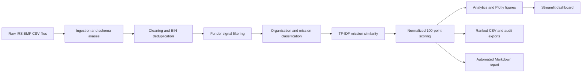

# Grant Intelligence Platform

Grant Intelligence Platform is a portfolio-ready Python application that turns one or more raw IRS Exempt Organizations Business Master File (BMF) CSV extracts into an explainable, ranked foundation research queue. It combines a reusable ETL pipeline, configurable funder detection, mission classification, TF-IDF similarity, weighted decision scoring, Plotly analytics, automated reporting, and a Streamlit reviewer workflow.

The platform is designed as an internal decision-support tool for nonprofit development teams. Every score can be traced to a source record, a configuration rule, and an exported component breakdown.

> The included dataset is synthetic and exists only to demonstrate the workflow. Scores are research-priority signals—not evidence that an organization is accepting applications or is a confirmed strategic fit.

## What the project demonstrates

- Production-style, multi-file ETL with source lineage and schema aliases
- Data quality controls for EINs, duplicates, states, missing values, text, and numeric fields
- Configurable funder identification using subsection, name, NTEE, foundation-code, asset, and income signals
- Dictionary-driven organization and mission classification with no nonprofit-specific keyword logic embedded in Python
- A normalized 100-point scoring model with a machine-readable breakdown
- Optional TF-IDF cosine similarity against EcoServants' configurable mission statement
- Decision-ready distributions, rankings, filters, prospect details, and exports
- A Streamlit interface plus a reproducible command-line batch workflow
- Automated Markdown analysis reports with findings, limitations, and next steps
- Unit, integration, chart, and app-startup test coverage suitable for CI

## Architecture



`GrantIntelligencePipeline` is the only orchestrator. The Streamlit application and CLI both call it, which keeps interactive and batch results consistent.

## Quick start

### 1. Create an environment

```bash
python -m venv .venv
```

Windows PowerShell:

```powershell
.venv\Scripts\Activate.ps1
```

macOS or Linux:

```bash
source .venv/bin/activate
```

### 2. Install

```bash
python -m pip install --upgrade pip
pip install -e ".[dev]"
```

### 3. Run the dashboard

```bash
streamlit run streamlit_app.py
```

The dashboard opens with the synthetic example already selected, so the default page is useful before any upload. Use the sidebar to upload one or more real BMF CSVs, tune filters and weights, and rerun the pipeline.

### 4. Run a batch analysis

```bash
grant-intelligence examples/sample_bmf.csv --output-root .
```

Equivalent module command:

```bash
python -m grant_intelligence examples/sample_bmf.csv --output-root .
```

Useful overrides:

```bash
grant-intelligence data/raw/eo1.csv data/raw/eo2.csv \
  --min-assets 500000 \
  --min-income 100000 \
  --target-state MD \
  --target-state VA \
  --output-root .
```

## Dashboard workflow

The dashboard is organized around the development team's decision sequence:

1. **Upload and configure** — combine multiple CSV files, set minimum financial thresholds, edit funder keywords, choose priority states, tune weights, and enable or disable NLP.
2. **Assess coverage** — review processed, qualified, High-priority, score, and asset KPIs.
3. **Understand the pool** — inspect state, priority, mission, asset, keyword, organization-type, and NTEE distributions.
4. **Build a research queue** — search and filter the exact ranked records.
5. **Inspect evidence** — see the identification signals, source lineage, semantic score, data-quality flags, and points awarded by each scoring component.
6. **Export** — download visible rankings, the complete reviewed population, the analysis report, or summary JSON.

Global view filters update every dashboard chart and ranked table. The processed and identified headline metrics remain explicitly labeled as run-level values.

## Pipeline details

### Ingestion

`src/grant_intelligence/ingestion.py` accepts filesystem paths or file-like uploads, reads UTF-8/Latin-1 CSVs, normalizes headers, maps common IRS BMF column names to a canonical schema, and adds `source_file` plus `source_row_number` lineage.

### Cleaning

`src/grant_intelligence/cleaning.py`:

- strips punctuation from EINs, validates exactly nine digits, and emits canonical `NN-NNNNNNN` values;
- standardizes full state names and abbreviations;
- normalizes organization names and searchable text;
- converts asset, income, and revenue fields to numeric values;
- selects the most recent and most complete record for duplicate valid EINs;
- preserves auditable quality flags; and
- optionally drops invalid EINs through configuration.

Missing numeric fields remain null rather than being silently treated as zero. This distinction matters for asset scoring and data-quality reporting.

### Funder identification

`src/grant_intelligence/filtering.py` creates transparent Boolean signals for:

- eligible IRS subsection;
- funder-related organization name;
- relevant NTEE prefix; and
- grant-making foundation code.

A likely funder must pass the configured subsection and financial rules and meet the configured minimum number of funder signals. The default thresholds are deliberately permissive; tighten them for a smaller research queue.

### Classification

`src/grant_intelligence/classification.py` reads all organization-type and mission-category logic from `config/keywords.yaml`. Each record receives:

- `organization_type`;
- `primary_mission_category`;
- `mission_category_confidence`;
- matched mission terms; and
- a JSON map of all category evidence scores.

Categories include Environment/Conservation, Sustainability, Education, Youth Development, Community Improvement, Volunteerism, Civic Engagement, Public Benefit, Health, Arts & Culture, Faith-Based, and Unknown.

### Semantic similarity

The optional NLP stage uses scikit-learn TF-IDF vectors and cosine similarity. Its reference text comes from `organization.mission` in `config/scoring.yaml`.

BMF records do not consistently include mission narratives. The platform therefore combines the organization name, optional `mission_description`, and normalized context. Similarity is most informative after enriching the input with authoritative mission or purpose text. Disable this component in the UI or CLI when only names are available.

### Scoring

Each component first produces a match value from 0 to 1. User weights are then normalized to total exactly 100 points:

```text
effective_weight_i = user_weight_i / sum(user_weights) × 100
final_score = sum(match_i × effective_weight_i)
```

Default components:

| Component | Default points | Evidence |
|---|---:|---|
| Organization type | 20 | Configured type hierarchy |
| Mission alignment | 20 | Mission category and confidence |
| Geography | 15 | Target, secondary, or other state |
| Asset size | 15 | Configured asset tiers; missing is distinct from zero |
| NTEE alignment | 15 | Longest matching configured NTEE prefix |
| Organization characteristics | 10 | EIN, subsection, name, foundation, and NTEE signals |
| Semantic similarity | 5 | TF-IDF cosine similarity |

Default priority bands are High (75+), Medium (55+), Low (35+), and Reject. Organizations that fail the likely-funder rules are always Reject, even if isolated attributes would otherwise produce points.

## Configuration without code changes

Edit the YAML files in `config/`:

- `schema.yaml` — source aliases, canonical columns, cleaning behavior;
- `keywords.yaml` — funder keywords, NTEE signals, organization types, mission dictionaries;
- `scoring.yaml` — mission statement, NLP settings, geography, weights, tiers, thresholds, report content.

To adapt the platform for another nonprofit:

1. Replace `organization.name` and `organization.mission`.
2. Update the mission-category dictionaries and NTEE alignment scores.
3. Set target and secondary states.
4. Tune component weights and priority thresholds.
5. Review sample false positives and false negatives before operational use.

No Python edits are required for these changes.

## Input expectations

The minimum usable input contains an EIN and organization name. The packaged alias map recognizes common BMF headings such as `EIN`, `NAME`, `SUBSECTION`, `FOUNDATION`, `ASSET_AMT`, `INCOME_AMT`, `NTEE_CD`, and `TAX_PERIOD`.

The pipeline preserves additional input columns. See `docs/data-dictionary.md` for canonical and derived fields.

Place raw extracts in `data/raw/`. This directory is ignored by Git because BMF exports can be large. Use the dashboard upload flow for interactive analysis or the CLI for repeatable local batch runs.

## Generated artifacts

A CLI run creates timestamped files:

```text
data/processed/
├── ranked_funders_<run_id>.csv
├── reviewed_organizations_<run_id>.csv
└── analysis_summary_<run_id>.json

reports/
└── grant_intelligence_report_<run_id>.md
```

The reviewed export includes rejected organizations and is the audit surface for false-positive/false-negative review. The ranked export includes only identified likely funders.

## Project structure

```text
grant-intelligence-platform/
├── config/                    # Schema, dictionaries, weights, mission, thresholds
├── data/
│   ├── raw/                   # Local BMF extracts (Git-ignored)
│   └── processed/             # Timestamped scored exports (Git-ignored)
├── docs/                      # Architecture, methodology, dashboard brief, dictionary
├── examples/                  # Synthetic BMF-shaped demonstration data
├── reports/                   # Generated analysis reports (Git-ignored)
├── src/grant_intelligence/    # Reusable Python package
├── tests/                     # Unit and end-to-end tests
├── streamlit_app.py           # Interactive application entrypoint
├── pyproject.toml             # Package, dependencies, test and lint settings
└── Dockerfile                 # Reproducible containerized dashboard
```

## Quality checks

```bash
ruff check .
pytest --cov=grant_intelligence --cov-report=term-missing
```

The tests cover schema aliases, EIN/state normalization, duplicate selection, funder signals, category assignment, 100-point score reconciliation, expected end-to-end sample results, export generation, and Plotly figure construction.

## Docker

```bash
docker build -t grant-intelligence-platform .
docker run --rm -p 8501:8501 grant-intelligence-platform
```

Then open `http://localhost:8501`.

## Operational limitations

- BMF data identifies exempt organizations; it does not provide current application windows, program restrictions, historical grants, or decision-maker contacts.
- BMF financial fields may be missing or lag the latest filing.
- Name and NTEE signals can produce false positives and false negatives.
- Mission similarity based only on an organization name is weak; enrich with authoritative mission text where possible.
- A ranked result should start human research, not replace diligence.

Recommended production enrichment includes Form 990/990-PF histories, funder websites, application calendars, past grantees, contact pathways, and observed outreach outcomes.

## License

MIT. See `LICENSE`.

